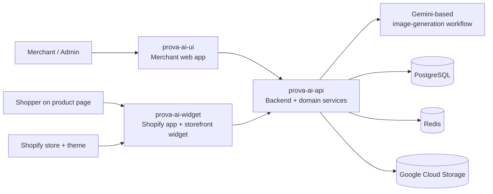
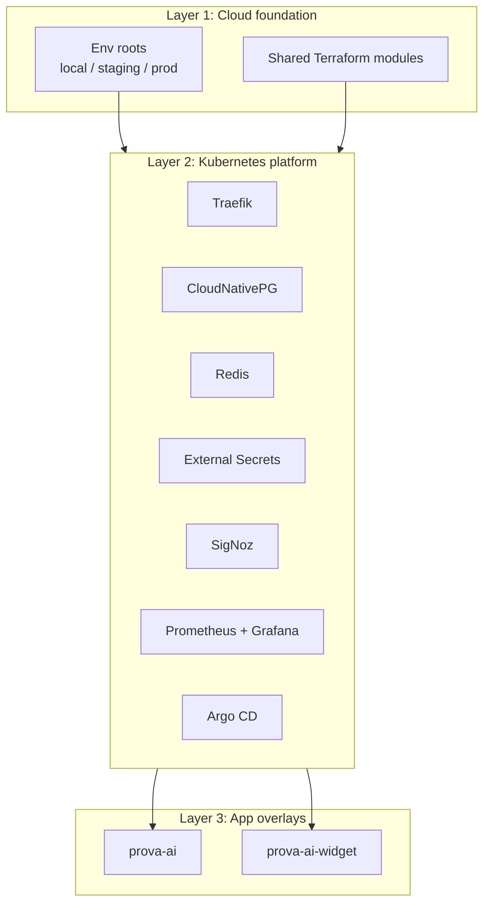

# ProvaAI — Technical Product Showcase

ProvaAI is a virtual try-on product for fashion e-commerce. It combines a merchant-facing web application, a Shopify storefront widget, and a backend platform that orchestrates image processing, AI generation, storage, and deployment.

This repository is a **public technical documentation showcase** for the product. It focuses on architecture, infrastructure, system boundaries, and engineering decisions. The implementation repositories remain private.

---

## Why this project is technically interesting

1. **Multi-surface product architecture**
   - merchant/admin SaaS interface
   - Shopify app and storefront widget
   - backend platform and infra ownership

2. **AI-driven asynchronous workflow**
   - shopper uploads a photo
   - the backend creates a fitting session
   - AI generates the result
   - the client polls and renders the output

3. **Integration-heavy system design**
   - Shopify storefront and embedded app concerns
   - AI image-generation workflow
   - cloud storage, caching, and persistence

4. **Infrastructure maturity beyond app code**
   - Terraform for cloud foundation
   - Kubernetes overlays by environment
   - observability, GitOps, and deployment promotion patterns

---

## High-level architecture

**Architecture summary:**
- `prova-ai-ui` supports merchant operations.
- `prova-ai-widget` delivers the storefront try-on experience inside Shopify.
- `prova-ai-api` owns domain logic, orchestration, storage, integrations, and deployment structure.

---

## Technology stack

| Layer | Primary technologies |
|---|---|
| Merchant/admin frontend | Next.js 14, React 18, TypeScript, Tailwind CSS, Zustand, Framer Motion |
| Shopify app + widget | React Router 7, React 18, TypeScript, Shopify App Bridge, Polaris, Prisma, Vite |
| Backend | .NET 10, C# 14, ASP.NET Core, modular domain libraries |
| Data | PostgreSQL, Redis, EF Core, Prisma |
| Storage | Google Cloud Storage |
| AI workflow | Gemini-based image generation |
| Platform | Kubernetes, Kustomize, Helm, Traefik |
| Infrastructure as code | Terraform |
| Observability | SigNoz, Prometheus, Grafana |
| Delivery workflow | GitHub Actions, Taskfile, Tilt, DevBox, Argo CD |

**Deep dive:** [`docs/overview/technology-stack.md`](docs/overview/technology-stack.md)

---

## Repository map

| Repository | Role |
|---|---|
| `prova-ai-api` | Backend API, domain services, infrastructure-as-code, Kubernetes deployment model |
| `prova-ai-ui` | Merchant/admin web application |
| `prova-ai-widget` | Shopify embedded app and storefront virtual try-on widget |

**Deep dive:** [`docs/overview/repository-map.md`](docs/overview/repository-map.md)

---

## Infrastructure highlights

The strongest infrastructure story in ProvaAI is the explicit three-layer deployment model encoded in `prova-ai-api/dply/`:

1. **Cloud foundation** — Terraform modules and per-environment roots
2. **Platform services** — shared Kubernetes services such as Traefik, CloudNativePG, Redis, External Secrets, SigNoz, Grafana, and Argo CD
3. **Application overlays** — environment-specific Kubernetes overlays for the main app and the Shopify-side runtime

### Deployment model

**Deep dive:** [`docs/infrastructure/infrastructure-overview.md`](docs/infrastructure/infrastructure-overview.md)

---

## What this portfolio documents

This repo is structured to support two reading modes:

1. **Fast scan** for recruiters and hiring managers
2. **Deep technical review** for senior engineers and tech leads

### Overview
- [`docs/overview/technology-stack.md`](docs/overview/technology-stack.md)
- [`docs/overview/repository-map.md`](docs/overview/repository-map.md)

### Architecture
- [`docs/architecture/system-architecture.md`](docs/architecture/system-architecture.md)

### Infrastructure
- [`docs/infrastructure/infrastructure-overview.md`](docs/infrastructure/infrastructure-overview.md)

### Authoring references
- [`docs/references/source-inventory.md`](docs/references/source-inventory.md)

---

## Product flow in one paragraph

A merchant manages products and operational flows through the web application. On the storefront side, a shopper opens the Shopify widget on a product page, uploads or captures a photo, and starts a fitting session. The backend stores the inputs, calls the AI generation workflow, persists the result, and returns access to the generated try-on output when processing completes.

---

## Screenshots / product tour

Screenshots will be added under:

- `assets/screenshots/`

Supporting documentation for that section will live under future showcase docs. For now, the repository is focused on the system and infrastructure narrative first.

---

## Why this work is worth showcasing

From an engineering perspective, the most notable parts of ProvaAI are:

1. designing a product that spans **merchant UI, storefront UX, and backend platform concerns**
2. turning AI image generation into a **production-style asynchronous workflow**
3. keeping Shopify-specific concerns isolated from the core backend
4. encoding infrastructure ownership and environment boundaries directly in the repository structure
5. treating observability, secrets, and deployment promotion as part of the architecture instead of afterthoughts

---

## Current documentation status

Completed so far:

- technology stack overview
- repository map
- system architecture
- infrastructure overview
- source inventory for documentation traceability

Planned next:

- request and data flows
- repository-specific deep dives
- screenshots and showcase sections
- engineering decisions and lessons learned

---

## Scope note

This repository intentionally documents the product at a public-safe level. It is meant to show system design, technical depth, and infrastructure thinking without exposing private implementation code or sensitive operational details.
