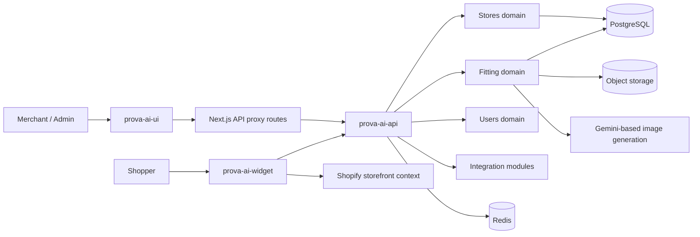
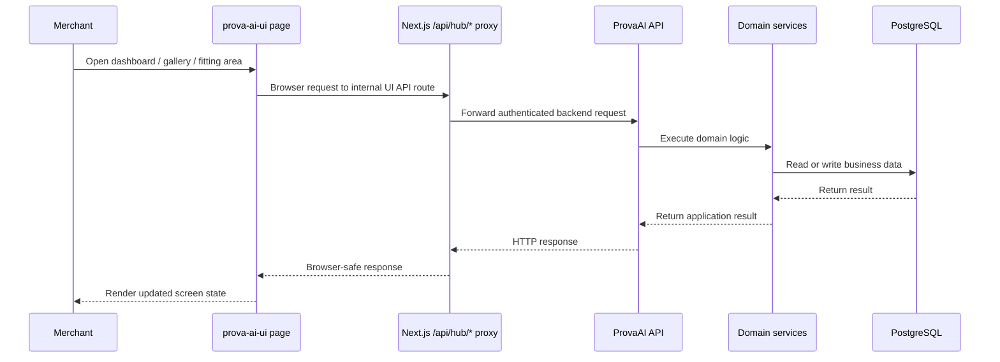
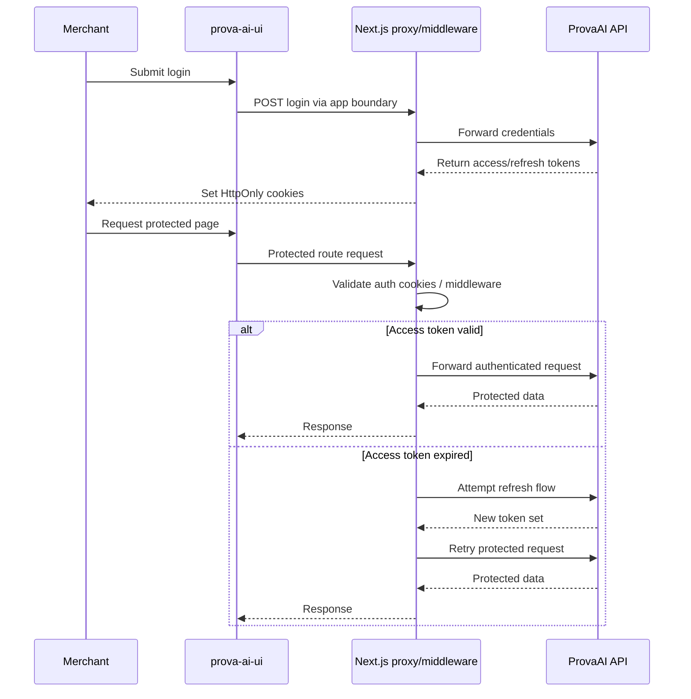
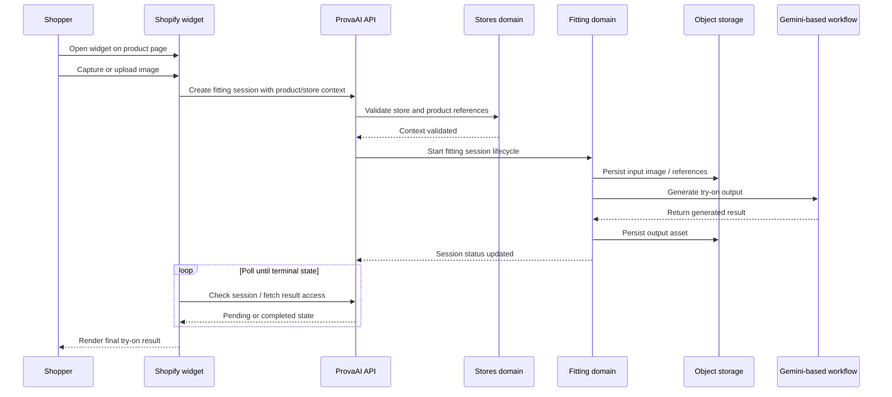
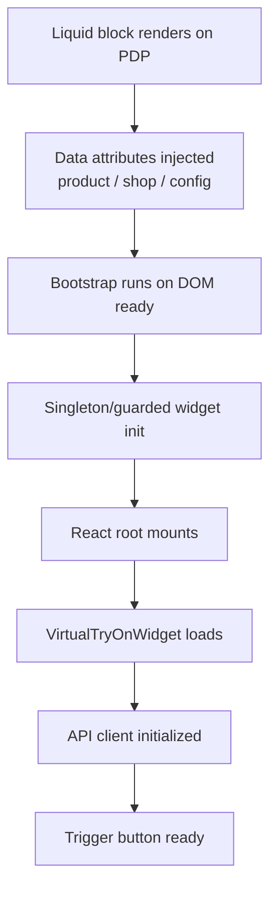
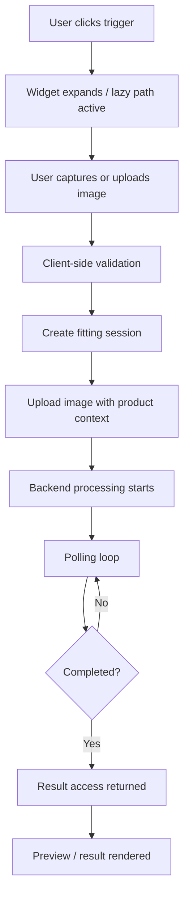
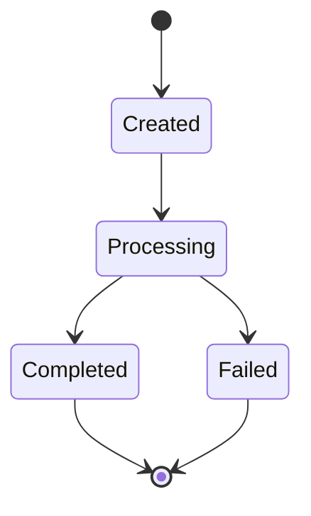

# ProvaAI Request and Data Flows

This document explains how requests move through ProvaAI and how data changes hands between the main product surfaces.

It complements:

- [`system-architecture.md`](./system-architecture.md) for system boundaries
- [`../infrastructure/infrastructure-overview.md`](../infrastructure/infrastructure-overview.md) for deployment/runtime structure

The focus here is narrower: **who calls what, in what order, and what kind of data moves between those steps**.

---

## 1. Flow Categories

ProvaAI has two request patterns that matter most:

1. **merchant/admin flows**
   - authenticated users working through the web app
2. **shopper virtual try-on flows**
   - storefront users interacting through the Shopify widget

The merchant side is more like a conventional SaaS application.
The storefront side is more like an asynchronous media-processing workflow.

---

## 2. End-to-End Request Landscape

### Reading this diagram

- The **web app** usually talks to the backend through its own proxy/auth layer.
- The **Shopify widget** talks more directly as an embedded integration surface.
- The **fitting domain** is the critical asynchronous processing path.
- The **stores domain** supplies product/store context required by fitting operations.

---

## 3. Merchant/Admin Request Flow

The merchant-facing application uses `prova-ai-ui` as a controlled front door for authenticated product operations.

### Main characteristics

1. the UI uses Next.js route handlers as proxy boundaries
2. auth state is managed with HttpOnly cookie flows
3. product, gallery, and fitting actions ultimately resolve into backend API requests

### Why the proxy layer matters

From the UI documentation, the app routes requests through internal endpoints such as:

- `/api/hub/*`
- `/api/hub-upload/*`
- `/api/logout/*`

This pattern helps the UI keep:

- auth cookie handling
- refresh behavior
- browser/backend separation

inside the web app boundary instead of leaking that complexity into every screen component.

---

## 4. Merchant Authentication and Session Flow

The UI docs describe an HttpOnly-cookie-based auth model.

### Important note

For portfolio purposes, the key story is not the exact cookie names. The key story is that the UI uses a **server-mediated auth boundary** rather than exposing all backend auth handling directly to browser code.

---

## 5. Storefront Virtual Try-On Flow

This is the most important product flow in the system.

From the widget and UI docs, the flow has four broad stages:

1. **context setup**
2. **session creation and upload**
3. **asynchronous processing**
4. **result retrieval and rendering**

### What is happening under the hood

- the widget carries **storefront context** from the Shopify product page
- the backend validates the **store/product relationship**
- the fitting module creates a **session object with lifecycle state**
- files move through **object storage**, not just in-memory request handling
- the result comes back through a **polling-based asynchronous pattern**

This is why ProvaAI is better understood as a workflow product, not a single synchronous API call.

---

## 6. Widget Initialization Flow

The widget docs describe a layered, defensive initialization model.

### Why this matters

This initialization path is designed to protect the Shopify product page:

1. widget startup is isolated
2. rendering is defensive
3. the page should survive widget failure
4. heavier interaction is delayed until the user actually engages

That is a strong design choice for an embedded commerce experience.

---

## 7. Widget Interaction and Processing Flow

The widget docs also describe the internal processing sequence at a more detailed level.

### Client-side responsibilities

The storefront runtime is responsible for:

- collecting image input
- validating file constraints
- shaping API requests
- managing loading/error/completed states
- deciding when to poll and when to stop

### Backend-side responsibilities

The backend is responsible for:

- creating the fitting session record
- storing inputs and outputs
- calling the AI workflow
- updating session status
- exposing a retrievable result once processing completes

---

## 8. Session Lifecycle Model

The fitting module documentation points to an explicit lifecycle-based design.

### Why this is important

A session model creates a clean boundary for:

- retries
- status inspection
- failure reporting
- auditability
- async client polling

Without a session lifecycle, the product would have to hide long-running processing inside fragile request/response behavior.

---

## 9. Data Responsibilities by Layer

| Layer | Main data handled | Primary concerns |
|---|---|---|
| `prova-ai-ui` | auth/session browser state, merchant actions, screen data | secure routing, proxying, UX state |
| `prova-ai-widget` | product-page context, image file input, processing state | safe embed behavior, validation, polling |
| `ProvaAI.Stores` | stores, store products, integration config, product media refs | catalog integrity, store/product validity |
| `ProvaAI.Fitting` | fitting sessions, input/output file refs, process status, usage info | async orchestration, AI integration, asset lifecycle |
| Shared storage/services | object/file references and durable media | access control, persistence, retrieval |
| PostgreSQL / Redis | transactional state and runtime support state | consistency, lookup, performance |

---

## 10. Request Boundary Decisions

Several architectural decisions show up clearly when looking at flows instead of static structure.

### 1. UI requests are mediated
The web app does not behave like a thin static client. It uses proxy routes and auth-aware boundaries.

**Benefit:** better control over session and token handling.

### 2. Widget requests are workflow-oriented
The storefront widget is organized around session creation, processing, and retrieval.

**Benefit:** better fit for AI latency and external processing uncertainty.

### 3. Domain validation happens before expensive processing
Store and product context must be valid before fitting work proceeds.

**Benefit:** avoids wasting AI/storage work on invalid requests.

### 4. File-bearing operations are separated from ordinary data reads
The docs point to separate upload and file-access patterns.

**Benefit:** cleaner handling of multipart input, signed/controlled file access, and media-specific concerns.

---

## 11. Public-Safe Takeaways

For portfolio readers, the most important request/data-flow story is:

1. ProvaAI combines **standard SaaS request patterns** with **asynchronous AI-media workflows**.
2. The merchant UI and the storefront widget have **different boundary models** because they solve different problems.
3. The fitting experience is built around a **session lifecycle**, not a single blocking request.
4. The product has clear movement of responsibility across:
   - browser surface
   - backend domain modules
   - storage
   - AI generation
   - result retrieval

That is the flow-level evidence that the product is architected, not just assembled.
