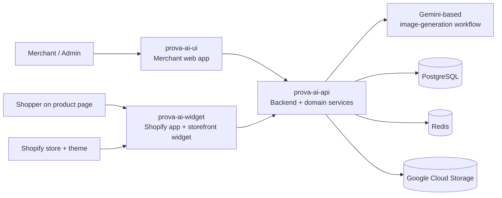
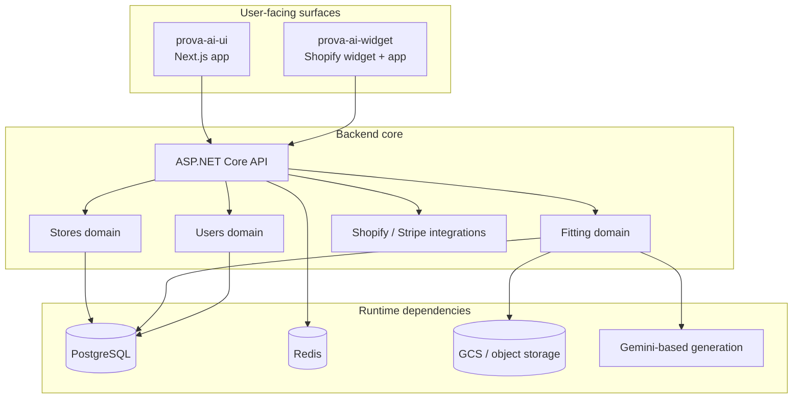
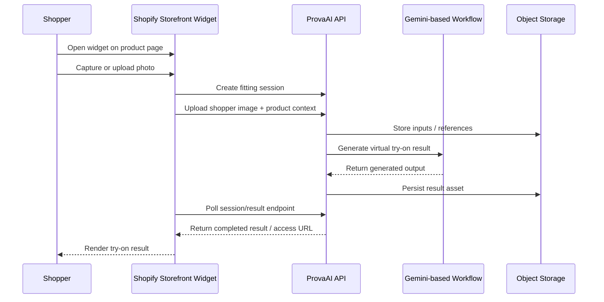
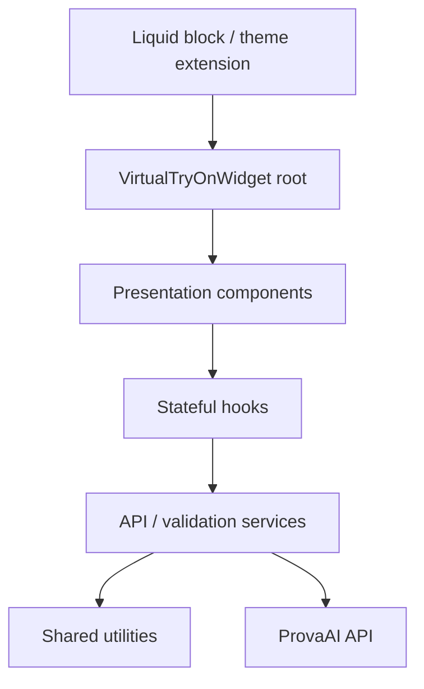

# ProvaAI System Architecture

This document explains how ProvaAI works as a product, not just as a set of repositories.

At a high level, ProvaAI is a virtual try-on platform for fashion e-commerce. It combines:

- a merchant/admin web application
- a Shopify app and storefront widget
- a backend platform that owns business logic, AI orchestration, persistence, and deployment

The most important architectural characteristic is that the product serves **two different user surfaces** at once:

1. **merchants/operators** using management flows
2. **shoppers** using virtual try-on directly from the storefront

---

## 1. Architecture at a Glance

### What this means

- The **UI** is optimized for merchant-side administration and operations.
- The **widget** is optimized for embedded storefront usage inside Shopify.
- The **backend** is the coordination point that turns uploads, products, auth, and AI processing into a working try-on flow.

---

## 2. Product Surfaces

### A. Merchant/admin surface

The merchant-facing side lives primarily in `prova-ai-ui`.

Its responsibilities include:

- authentication and protected navigation
- product and gallery management
- fitting-session interaction from the SaaS side
- role-aware dashboard and admin flows
- proxy-style integration with the backend API

This surface is where operators manage the product and inspect its outputs.

### B. Storefront shopper surface

The shopper-facing side lives primarily in `prova-ai-widget`.

Its responsibilities include:

- embedding into Shopify product detail pages
- opening the virtual try-on interaction
- capturing or uploading the shopper photo
- calling backend APIs to create and process fitting sessions
- polling for completion and rendering results safely inside the host storefront

This surface is where the core end-user value is delivered.

### C. Backend/core platform surface

The backend lives in `prova-ai-api`.

Its responsibilities include:

- exposing application APIs
- coordinating fitting-session lifecycle
- integrating with AI generation
- storing metadata and media references
- managing infrastructure, deployment, and operational topology

---

## 3. Repository-to-Architecture Mapping

| Repository | Architectural role | Why it exists separately |
|---|---|---|
| `prova-ai-api` | Core system and platform backbone | Backend logic and infrastructure evolve together and need operational ownership |
| `prova-ai-ui` | Merchant/admin application | Merchant workflows are different from storefront concerns |
| `prova-ai-widget` | Shopify integration boundary | Embedded app and storefront widget need Shopify-specific runtime and deployment patterns |

This is not an arbitrary split. It mirrors the system’s real boundaries:

- product operations
- storefront interaction
- backend/platform ownership

---

## 4. Core Runtime Architecture

### Architectural reading

- The API layer is not just a thin transport layer; it fronts multiple domain modules.
- The fitting domain is the most product-distinctive part of the system because it coordinates media processing, AI execution, and result lifecycle.
- Storage is split by responsibility:
  - PostgreSQL for business/transactional state
  - Redis for fast runtime state and support patterns
  - GCS for image and generated asset storage

---

## 5. Virtual Try-On Request Flow

This is the most important end-to-end product flow in the system.

### Why this flow matters

It shows that ProvaAI is not a static storefront feature. It is an **asynchronous workflow product** that coordinates:

- browser-side capture/upload
- product/store context
- backend orchestration
- AI/media generation
- result retrieval and display

---

## 6. Shopify Widget Architecture

The Shopify widget is one of the strongest architectural parts of the system because it uses a layered client architecture instead of collapsing everything into one embedded script.

### Widget design principles

From the repo docs, the widget emphasizes:

1. **defensive rendering**
   - it should not break the Shopify product page if initialization fails
2. **lazy loading**
   - minimizes storefront cost before interaction
3. **clear separation of concerns**
   - UI, state, services, and utilities are kept distinct
4. **retry/error handling**
   - appropriate for network- and processing-dependent flows

That is especially important in embedded commerce contexts, where fragile client code can directly hurt conversion.

---

## 7. Backend Domain Shape

The backend is structured as a modular solution rather than one undifferentiated web project.

Notable modules include:

- `ProvaAI.API`
- `ProvaAI.Fitting`
- `ProvaAI.Stores`
- `ProvaAI.Users`
- `ProvaAI.Payments`
- `ProvaAI.Integrations.Shopify`
- `ProvaAI.Integrations.Stripe`
- shared libraries under `src/shrd/`

### Why this matters

This structure supports a product that has to combine:

- standard SaaS concerns such as auth and admin workflows
- commerce/domain concerns such as stores and products
- AI workflow concerns such as fitting-session processing
- external integration concerns such as Shopify and payments

The `Fitting` module is especially important because it represents the product’s differentiating capability, not just generic application plumbing.

---

## 8. Architectural Decisions That Stand Out

### 1. Multi-repo product split
Instead of forcing all surfaces into one codebase, ProvaAI keeps:

- platform/backend concerns
- merchant web-app concerns
- Shopify/storefront concerns

in separate repositories.

**Benefit:** clearer ownership and deployment boundaries.

**Tradeoff:** more cross-repo coordination and documentation overhead.

### 2. Backend + infrastructure co-owned in the same repo
The backend repo also owns the deployment model.

**Benefit:** architecture and operations stay aligned.

**Tradeoff:** the repo carries both application and platform complexity.

### 3. Layered storefront widget
The widget uses explicit layers instead of ad hoc DOM scripting.

**Benefit:** maintainability, testability, and safer storefront behavior.

**Tradeoff:** more upfront engineering discipline for a feature many teams would implement as a lightweight script.

### 4. Asynchronous AI orchestration
The virtual try-on flow is modeled as a session/process lifecycle rather than as a blocking synchronous request.

**Benefit:** better fit for real-world image generation latency and result retrieval.

**Tradeoff:** requires polling, storage coordination, and clearer state handling.

---

## 9. Public-Safe Technology Story

For public portfolio purposes, the most valuable architectural story is:

1. ProvaAI is a **multi-surface AI commerce product**.
2. It combines a **merchant SaaS interface**, a **Shopify storefront integration**, and a **backend orchestration platform**.
3. The core product value comes from an **AI-driven asynchronous try-on workflow**.
4. The system architecture reflects real engineering concerns:
   - platform boundaries
   - external integrations
   - state and media handling
   - deployment and operational maturity

---

## 10. Relationship to Infrastructure Docs

This document focuses on **system structure and product flow**.

The complementary infrastructure view lives in:

- `../infrastructure/infrastructure-overview.md`

That document explains how this architecture is deployed, segmented by environment, and operated in Kubernetes/Terraform.
