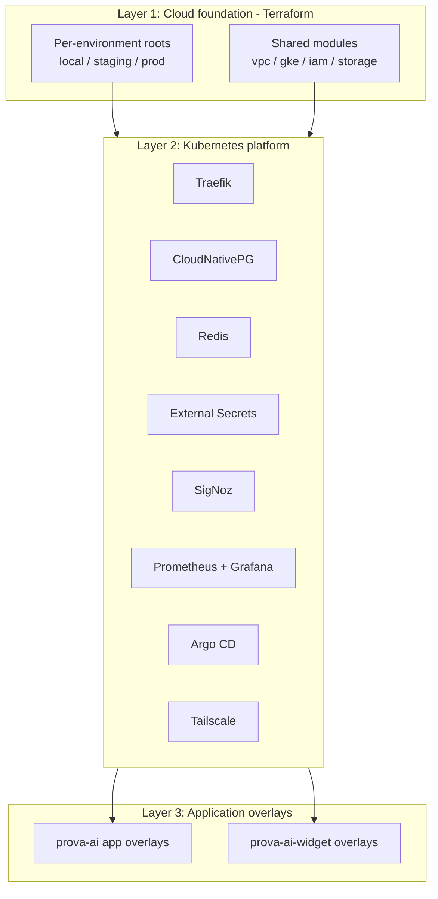
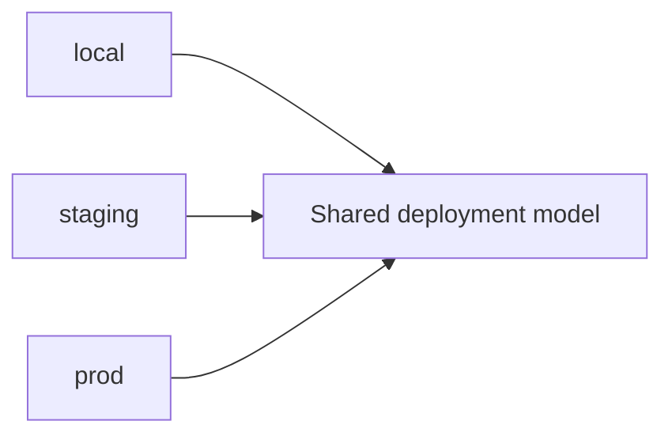
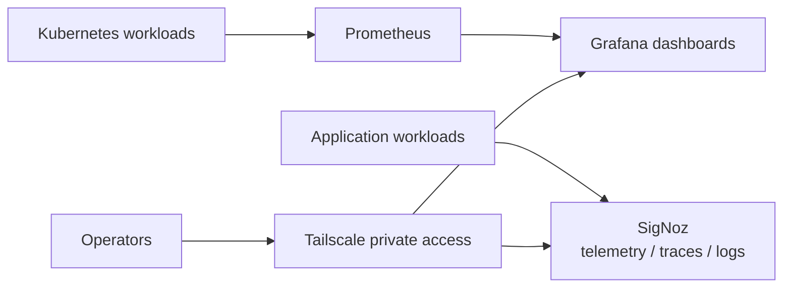

# ProvaAI Infrastructure Overview

This document explains how ProvaAI is deployed and operated at a high level.

The strongest infrastructure characteristic in this product is the explicit separation between:

1. **cloud foundation**
2. **shared Kubernetes platform services**
3. **application-specific runtime overlays**

That structure appears directly in the repository under `prova-ai-api/dply/` and is one of the most portfolio-worthy engineering aspects of the system.

---

## 1. Infrastructure at a Glance

### Why this is important

This is not just “Kubernetes plus Terraform.” The repo encodes a deployment model with clear ownership and layering:

- Terraform owns cloud provisioning
- platform components own shared runtime capabilities
- application overlays own environment-specific app behavior

---

## 2. Repository Structure as Infrastructure Contract

The deployment structure is encoded directly in `prova-ai-api/dply/`.

### Terraform

- `dply/terraform/modules/`
- `dply/terraform/environments/local/`
- `dply/terraform/environments/staging/`
- `dply/terraform/environments/prod/`

### Kubernetes applications

- `dply/k8s/apps/prova-ai/base/`
- `dply/k8s/apps/prova-ai/overlays/{local,staging,prod}/`
- `dply/k8s/apps/prova-ai-widget/base/`
- `dply/k8s/apps/prova-ai-widget/overlays/{local,staging,prod}/`

### Kubernetes platform services

- `dply/k8s/platform/traefik/`
- `dply/k8s/platform/cnpg/`
- `dply/k8s/platform/external-secrets/`
- `dply/k8s/platform/redis/`
- `dply/k8s/platform/signoz/`
- `dply/k8s/platform/monitoring/`
- `dply/k8s/platform/argocd/`
- `dply/k8s/platform/tailscale/`

This matters because the folder layout is not decorative documentation; it is the operating model itself.

---

## 3. Three-Layer Deployment Model

## Layer 1 — Cloud foundation

Terraform defines the cloud-level primitives through:

- reusable modules
- per-environment roots
- directory-based environment selection

### Key characteristics

- environment selection is path-based, not Terraform workspace-based
- shared modules reduce duplication
- environment roots make changes explicit and auditable

### Why it is a strong design choice

Using separate environment roots favors clarity over cleverness. It reduces the risk of hidden state switching and makes infrastructure intent easier to review.

---

## Layer 2 — Shared Kubernetes platform

The platform layer provides common services needed by the workloads.

| Component | Role |
|---|---|
| Traefik | Ingress and request routing |
| CloudNativePG | PostgreSQL operator and database runtime |
| Redis | Cache / fast-access state |
| External Secrets | Secret sync from cloud secret stores |
| SigNoz | Application telemetry stack |
| Prometheus + Grafana | Cluster/workload monitoring and dashboards |
| Argo CD | GitOps-style app synchronization |
| Tailscale | Private operational exposure for internal tooling |

### Design pattern

Each major platform component is organized with:

- `base-values.yaml`
- `overlays/<env>/values.yaml`
- task-oriented operational wrappers

That gives the platform layer a consistent, repeatable structure.

---

## Layer 3 — Application overlays

Application manifests are split into:

- base manifests shared across environments
- overlays that express local/staging/prod differences

For the main `prova-ai` app, the structure follows the pattern documented in the deployment guide.

For `prova-ai-widget`, the `dply` tree shows the same operating idea applied to the Shopify-side runtime as well.

### Why this matters

This model makes environment-specific behavior explicit without duplicating the full application manifests for every environment.

---

## 4. Environment Model

The infrastructure docs and knowledge notes point to three canonical environments:

- `local`
- `staging`
- `prod`

### Environment characteristics

| Aspect | Local | Staging | Production |
|---|---|---|---|
| Purpose | Fast developer loop | Pre-production validation | Live runtime |
| Selection model | directory/overlay based | directory/overlay based | directory/overlay based |
| App runtime | local overlay via Tilt / Kustomize | staging overlays | prod overlays |
| Secrets model | local file bootstrap | external secret references | external secret references |
| Image promotion | local dev flow | mainline-driven updates | tag-gated updates |

### Important design decision

The environment model is **structural**, not implicit.

That means:

- environment identity is represented by directories
- overlay intent is visible in version control
- promotion logic is easier to reason about than with hidden mutable configuration

---

## 5. Infrastructure for Local Development

Local development is treated as a first-class environment rather than as an afterthought.

The deployment docs describe a local path built around:

- Tilt
- Kubernetes-based local runtime
- local app overlays
- placeholder-based secret bootstrap

### Why that matters

Many products document production infrastructure but leave local workflows informal. ProvaAI’s repo instead shows an attempt to make local development match the deployed model more closely.

That improves:

- onboarding
- repeatability
- fidelity between local and deployed behavior

---

## 6. Secrets and Configuration Strategy

A notable infrastructure improvement documented in the source material is the move away from tracked live secret material.

### Current pattern

- local development uses placeholder templates copied into git-ignored local files
- staging and production rely on External Secrets patterns
- secret handling is treated as part of the platform contract, not scattered ad hoc through app manifests

### Portfolio-safe takeaway

The important public story is not any specific secret value or operational detail. The important story is that the infrastructure evolved toward:

- better secret hygiene
- cleaner config boundaries
- reduced credential exposure in version control

---

## 7. Observability and Operations

The knowledge base identifies the current observability model as:

- **SigNoz** for application telemetry, logs, and traces
- **Prometheus + Grafana** for cluster and workload dashboards
- **Tailscale** for private access to selected internal operational UIs

### Operational interpretation

This separates two kinds of visibility:

1. **application telemetry**
2. **infrastructure/workload health**

That is a more mature operational posture than relying on logs alone.

---

## 8. GitOps and Deployment Automation

The knowledge notes indicate a centralized GitOps direction using Argo CD for application synchronization, while some platform components remain manually managed through Taskfile-driven workflows.

### Practical model

- application definitions are present under Argo CD manifests
- image promotion updates overlays rather than editing one shared deployment file
- Taskfile remains an important operational interface for targeted component deployment

### Why this is a good portfolio story

It shows a system moving beyond “kubectl apply by hand” toward:

- declarative sync
- controlled image promotion
- clearer environment promotion rules

without pretending every part of the platform is fully abstracted away.

---

## 9. Infrastructure Responsibilities by Concern

| Concern | Primary mechanism |
|---|---|
| Cloud provisioning | Terraform |
| Environment selection | directory-based env roots and overlays |
| Shared platform services | Helm-style values + Kubernetes platform directories |
| App deployment composition | Kustomize base + overlays |
| Secret delivery | External Secrets + local ignored files |
| Telemetry | SigNoz |
| Monitoring dashboards | Prometheus + Grafana |
| GitOps app sync | Argo CD |
| Private operator access | Tailscale |
| Task automation | Taskfile |

---

## 10. What Makes This Infrastructure Worth Showcasing

From a portfolio perspective, the strongest infrastructure takeaways are:

1. **clear layering**
   - cloud foundation
   - platform services
   - application overlays

2. **explicit environment model**
   - local, staging, and prod are represented directly in the repo structure

3. **operational maturity**
   - observability, secret hygiene, and deployment promotion are treated as design concerns

4. **infrastructure-as-architecture**
   - the repo layout itself expresses ownership and deployment boundaries

5. **room for evolution without chaos**
   - the system shows evidence of refactoring toward a cleaner model rather than accumulating only one-off deployment fixes

---

## 11. Relationship to the Broader Product Architecture

This document describes **how ProvaAI is deployed and operated**.

The complementary product/system view lives in:

- `../architecture/system-architecture.md`

Use both together:

- `system-architecture.md` explains the product surfaces and request flows
- `infrastructure-overview.md` explains the runtime, environment, and platform model behind them
