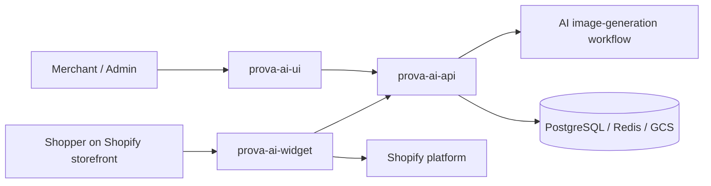

# ProvaAI Repository Map

This repository map explains how the ProvaAI product is split across its main codebases and why that split exists.

At a high level, ProvaAI is not a single application. It is a coordinated product made up of:

- a backend/platform repository
- a merchant-facing web application
- a Shopify app plus storefront widget

That separation reflects the product’s real operating boundaries: internal product logic, merchant administration, and shopper-facing storefront activation.

---

## 1. Repository Overview

| Repository | Primary role | Main technologies | Main audience |
|---|---|---|---|
| `prova-ai-api` | Backend API, domain services, infra-as-code, deployment model | .NET 10, C# 14, ASP.NET Core, EF Core, PostgreSQL, Redis, Kubernetes, Terraform | Backend/platform engineers |
| `prova-ai-ui` | Merchant/admin web application | Next.js 14, React 18, TypeScript, Tailwind CSS, Zustand | Merchants, internal operators, frontend engineers |
| `prova-ai-widget` | Shopify embedded app + storefront virtual try-on widget | React Router 7, React 18, TypeScript, Shopify App Bridge, Polaris, Prisma, Vite | Shopify merchants, storefront users, integration engineers |

---

## 2. How the Repositories Fit Together

### Boundary summary

- `prova-ai-ui` handles the merchant-facing web experience.
- `prova-ai-widget` handles the Shopify-facing integration surface and storefront try-on experience.
- `prova-ai-api` provides business logic, fitting orchestration, persistence, and infrastructure ownership.

---

## 3. `prova-ai-api`

### Goal

`prova-ai-api` is the technical core of the product. It owns both:

1. the backend application layer
2. the infrastructure and deployment model that runs the product

That makes it the repository with the broadest system responsibility.

### What it contains

#### Application responsibilities

- HTTP API surface for the product
- authentication and session-related backend logic
- store and product catalog management
- fitting-session lifecycle and orchestration
- integration support for Shopify and payments
- shared contracts and common libraries

#### Infrastructure responsibilities

- Terraform roots and reusable infrastructure modules
- Kubernetes platform services and app overlays
- local, staging, and production deployment structure
- CI/CD-aligned image promotion model
- observability and secret-management integration points

### Internal architecture shape

The backend repo is organized as a modular solution with separate service libraries and shared modules, including:

- `ProvaAI.API`
- `ProvaAI.Fitting`
- `ProvaAI.Stores`
- `ProvaAI.Users`
- `ProvaAI.Payments`
- `ProvaAI.Integrations.Stripe`
- `ProvaAI.Integrations.Shopify`
- shared libraries under `src/shrd/`
- tests under `src/tests/`

### Why this repo matters in the portfolio

This repo tells the strongest senior-engineering story because it demonstrates:

- service/domain modeling
- environment-aware infrastructure design
- Kubernetes and Terraform ownership
- observability and deployment thinking
- integration-heavy backend orchestration

---

## 4. `prova-ai-ui`

### Goal

`prova-ai-ui` is the merchant/admin web application. It gives store operators a dedicated interface for managing products, viewing results, and working through the virtual try-on workflow from the SaaS side.

### What it contains

- authentication and protected app routes
- dashboard and management screens
- product and fitting galleries
- virtual try-on interaction from the web app side
- API/proxy integration code for talking to the backend
- app shell, permissions, and supporting UI components

### Architectural role

The UI repo sits between the merchant and the backend domain services.

It is responsible for:

- turning backend capabilities into a usable administration experience
- protecting routes and session-aware flows
- presenting operational/product data in a manageable interface
- coordinating the browser-side user experience for authenticated users

### Notable implementation characteristics

- Next.js App Router structure
- route groups for public and protected flows
- shared layout/component system
- proxy/auth handling in `src/app/api/`
- domain-specific helpers for catalog and fitting features

### Why this repo matters in the portfolio

This repo shows the product’s operational surface: the system is not just an API and not just a demo widget. It includes a real management interface for the business workflow around virtual try-on.

---

## 5. `prova-ai-widget`

### Goal

`prova-ai-widget` connects ProvaAI to the Shopify ecosystem. It covers both the merchant-facing app integration and the shopper-facing storefront widget that appears on a product page.

### What it contains

- embedded Shopify app configuration and routes
- app auth/session and webhook plumbing
- Theme App Extension assets and configuration
- storefront widget UI and lifecycle logic
- widget build pipeline and Shopify deployment setup
- persistence for Shopify-related data using Prisma

### Architectural role

This repo is the bridge between:

- the Shopify platform
- merchant configuration workflows
- the storefront shopper experience
- the ProvaAI backend API

### Layered widget architecture

The widget docs describe a clean layered split:

1. presentation components
2. stateful custom hooks
3. services for API/validation logic
4. shared utilities

That is especially important because storefront widgets operate in a fragile environment: they must be lightweight, defensive, and safe to embed without breaking the host product page.

### Why this repo matters in the portfolio

This repo is a strong integration story because it shows:

- external platform integration beyond a standard SaaS app
- embedded-app and storefront-extension concerns in the same system
- asynchronous AI workflow coordination from a shopper-facing entry point
- stronger frontend architecture than a simple “widget script” approach

---

## 6. Cross-Repository Responsibility Split

| Concern | Primary repo | Notes |
|---|---|---|
| Core business logic | `prova-ai-api` | Main domain and orchestration center |
| Merchant/admin UX | `prova-ai-ui` | Management surface for authenticated product users |
| Shopify app integration | `prova-ai-widget` | Embedded app, webhooks, app config, merchant integration |
| Storefront try-on entry point | `prova-ai-widget` | Shopper-facing PDP experience |
| AI orchestration | `prova-ai-api` | Coordinates fitting-session processing |
| Product and media persistence | `prova-ai-api` | Main backend persistence and storage integration |
| Kubernetes/Terraform infrastructure | `prova-ai-api` | Platform and deployment ownership |
| Observability and deployment automation | `prova-ai-api` | Infra and runtime operations anchor |

---

## 7. Why a Multi-Repo Split Makes Sense Here

This product has three different kinds of boundaries:

1. **Operational boundary**
   - backend and infrastructure evolve differently from frontend surfaces

2. **Platform boundary**
   - Shopify app/widget concerns are materially different from the standalone web UI

3. **Audience boundary**
   - merchants using an admin dashboard are different from shoppers seeing a storefront widget

Because of that, the split is not arbitrary. It mirrors the actual product architecture.

### Benefits of the split

- clearer ownership per surface
- easier deployment and release boundaries
- better isolation of platform-specific concerns
- cleaner portfolio story around system design

### Tradeoff

The downside is coordination complexity: product behavior spans repositories, so good contracts and documentation matter more than in a monolith.

---

## 8. Important Supporting Material Inside Each Repo

### `prova-ai-api`
Best source material for portfolio docs:

- `README.md`
- `src/docs/deployment/README.md`
- `dply/**`
- service `README.md` files under `src/srvcs/`

### `prova-ai-ui`
Best source material for portfolio docs:

- `README.md`
- `docs/ai-context/CONTEXTO_PROJETO.md`
- `src/app/`, `src/components/`, `src/lib/`, `src/store/`

### `prova-ai-widget`
Best source material for portfolio docs:

- `README.md`
- `docs/architecture.md`
- `docs/WIDGET_ARCHITECTURE.md`
- `extensions/src/prova-ai-widget-extension/`

---

## 9. What This Means for the Portfolio Repo

The public portfolio repo should not just list these repositories. It should explain the system logic behind them:

- why each repo exists
- what role it plays in the product
- how it communicates with the others
- what technical decisions are most worth highlighting

That is why the next documents in this portfolio are organized around:

- overall system architecture
- request and data flows
- infrastructure design
- repo-specific deep dives

---

## 10. Scope Note

A historical UI context note also references a landing-page repository (`prova-ai-lp`).

For the current portfolio documentation set, the main focus is the three repositories that are clearly present and documented in the current product workspace:

- `prova-ai-api`
- `prova-ai-ui`
- `prova-ai-widget`

If the landing-page repo becomes important later, it can be documented as an additional supporting surface rather than part of the current core technical architecture.
