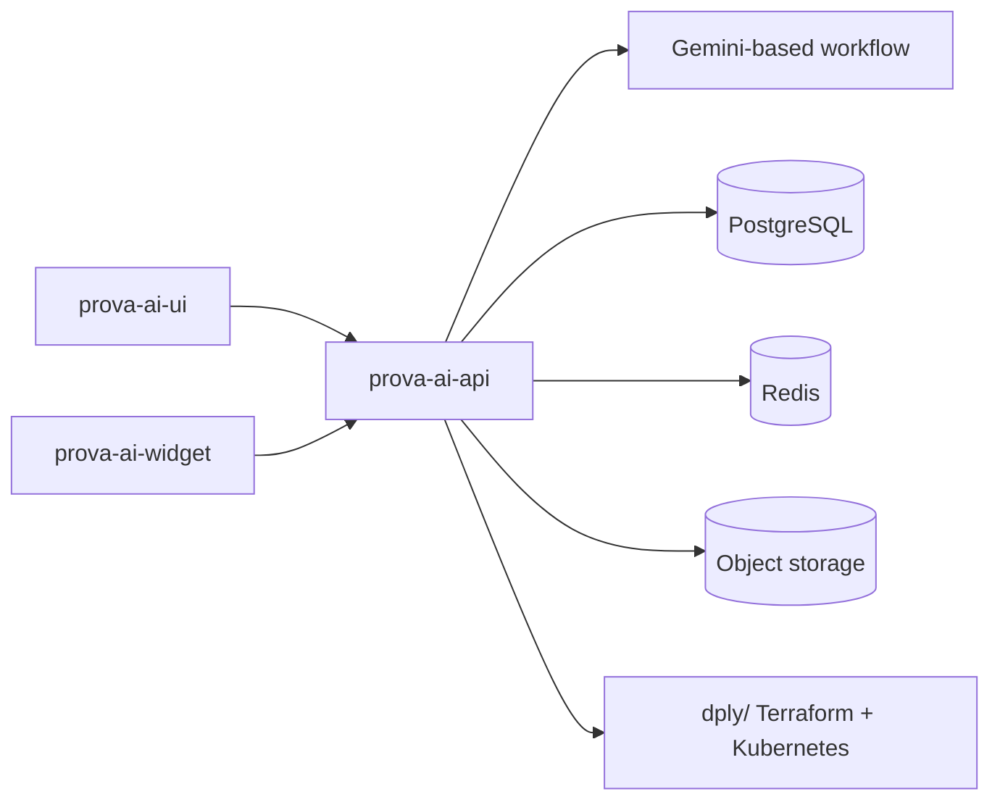
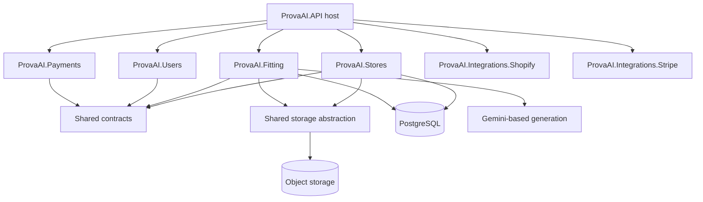
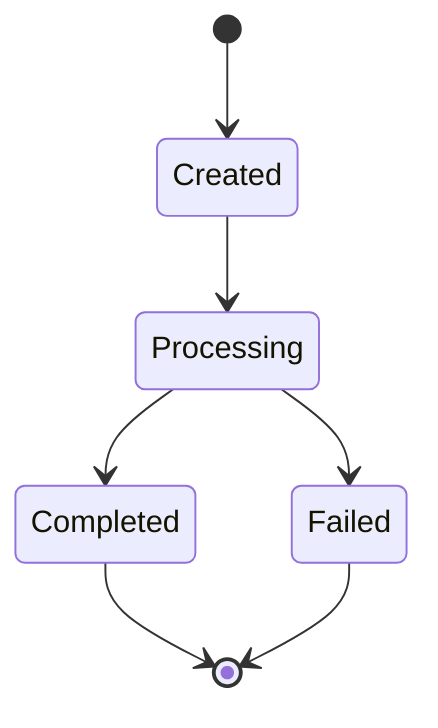

# `prova-ai-api`

`prova-ai-api` is the technical backbone of ProvaAI.

It is both:

1. the **backend application repository**
2. the **deployment and infrastructure repository**

That combination makes it the most system-critical repository in the product. It is where business logic, AI orchestration, storage, integrations, Kubernetes deployment structure, and cloud provisioning all come together.

---

## 1. Why this repository matters

From a portfolio perspective, this is the strongest senior-engineering story in the product because it shows work across multiple layers at once:

- backend API design
- domain-driven service decomposition
- asynchronous AI/media workflows
- storage and data handling
- Kubernetes/Terraform deployment design
- observability and operational structure
- multi-environment delivery

Many products have a backend repo. Fewer have a backend repo that also expresses the runtime architecture this explicitly.

---

## 2. Repository role in the whole product

### Summary

`prova-ai-api` is responsible for:

- serving backend application capabilities to the UI and widget
- owning the core product domains such as stores and fitting sessions
- integrating with external systems such as Shopify and Stripe
- persisting application and media state
- defining how the platform is deployed across local, staging, and production environments

---

## 3. What the repository contains

At a high level, the repo contains four major layers:

| Layer | What it contains | Why it matters |
|---|---|---|
| Application host | ASP.NET Core API app and service wiring | Exposes product capabilities over HTTP |
| Domain/service modules | `ProvaAI.Fitting`, `ProvaAI.Stores`, `ProvaAI.Users`, integrations, payments | Keeps business concerns separated by responsibility |
| Shared libraries | contracts, shared utilities, storage abstraction | Reuse and cross-module consistency |
| Deployment/runtime | `dply/` Terraform + K8s structure | Encodes the real production operating model |

There is also a dedicated testing layer under `src/tests/`, including shared test infrastructure for repositories, services, and integrations.

---

## 4. Internal solution structure

The backend solution is modular rather than monolithic.

### Main service/domain projects

- `ProvaAI.API`
- `ProvaAI.Fitting`
- `ProvaAI.Stores`
- `ProvaAI.Users`
- `ProvaAI.Payments`
- `ProvaAI.Integrations.Stripe`
- `ProvaAI.Integrations.Shopify`
- `ProvaAI.Integrations.Core`
- `ProvaAI.Playground`

### Shared projects

- `ProvaAI.Shared`
- `ProvaAI.Shared.Contracts`
- `ProvaAI.Shared.Storage`

### Test projects

- `ProvaAI.Tests`
- `ProvaAI.Tests.Shared`
- `ProvaAI.Payments.Tests`
- `ProvaAI.Integrations.Stripe.Tests`
- `ProvaAI.Integrations.Shopify.Tests`

### Why this structure is good

This split reduces the risk of collapsing everything into one large API codebase with unclear ownership. It creates room for:

- domain isolation
- cleaner contracts between modules
- more focused tests
- infrastructure ownership that stays close to the app runtime

---

## 5. Key technical responsibilities

## A. HTTP API and application hosting

The repo’s top-level role is to host the backend application used by the product.

Responsibilities include:

- request handling
- auth-aware backend behavior
- service registration
- module composition
- environment-aware app startup

Although `ProvaAI.API` itself is lightly documented in the repo, the surrounding modules and deployment docs make its role clear: it is the application host that ties the rest of the solution together.

## B. Store and product domain

The `ProvaAI.Stores` module is responsible for the commerce-side domain model.

It handles:

- store lifecycle management
- product catalog management
- platform integration configuration
- product image storage integration
- search, filtering, and bulk operations

This module matters because fitting sessions depend on valid store and product context. The system does not treat the AI workflow as detached from catalog truth.

## C. Fitting-session domain

The `ProvaAI.Fitting` module is the product’s differentiating backend capability.

It handles:

- fitting session lifecycle management
- image upload processing
- AI generation orchestration
- token usage tracking
- result-file handling
- reporting and auditability

This is the most distinctive application module in the repository.

## D. Shared contracts and abstractions

The shared libraries provide cross-module consistency.

In particular:

- `ProvaAI.Shared.Contracts` defines interfaces and models shared across users, stores, and fitting
- `ProvaAI.Shared.Storage` abstracts file handling and signed/public URL generation

This matters because the system mixes transactional business data with file-heavy AI workflows. Shared contracts help keep those boundaries stable.

## E. Payments and external integrations

The repository also includes explicit integration modules rather than burying all third-party behavior inside the main API host.

Notable integration areas include:

- Shopify
- Stripe
- shared integration plumbing

That is a healthy separation because external platforms often evolve on different timelines from the core domain model.

---

## 6. Architecture inside the backend repo

### Reading this diagram

- `ProvaAI.API` is the application host, not the only place where the business logic lives.
- `ProvaAI.Stores` and `ProvaAI.Fitting` are important domain centers.
- shared contracts and shared storage keep cross-module boundaries explicit.
- the backend integrates both with conventional app infrastructure and with AI/media-specific workflows.

---

## 7. The fitting domain as the technical center of gravity

If one module best represents what makes ProvaAI distinct, it is `ProvaAI.Fitting`.

### What it does

- creates and tracks fitting sessions
- validates image-bearing requests
- carries user, store, and product context into processing
- calls an external image-generation workflow
- persists input and output references
- exposes status and result retrieval behavior

### Lifecycle model

### Why this matters

This is not a simple CRUD API. It is an asynchronous process-oriented backend.

That means the repository has to handle:

- long-running work
- status transitions
- file storage
- AI dependency failures
- result retrieval after processing
- usage tracking and auditability

That is a richer technical story than “backend receives request, writes row, returns response.”

---

## 8. The stores domain as the business anchor

The stores module is the business anchor that keeps the AI workflow attached to real commerce context.

It provides:

- store management
- product catalog operations
- product media handling
- platform-specific configuration
- validation rules around store/product identity

### Why this matters

The fitting flow depends on valid references such as:

- store ID
- product ID
- product image/media access
- integration configuration

That means `ProvaAI.Stores` is not a side module. It is a prerequisite domain for the system’s core try-on workflow.

---

## 9. Shared storage as a first-class backend concern

The repository includes `ProvaAI.Shared.Storage`, which is important for understanding the system.

This library provides:

- upload/download abstractions
- signed URL generation
- validation and metadata handling
- local emulator support
- public/private file access patterns

### Why that matters

ProvaAI is not just data plus API responses. It is also a media pipeline.

The storage layer supports:

- user-uploaded images
- product image assets
- generated output files
- controlled retrieval of those assets

That is why storage is treated as a first-class abstraction instead of incidental helper code.

---

## 10. Testing strategy

The backend repo also tells a strong quality story.

Most notably, `ProvaAI.Tests.Shared` provides reusable testing infrastructure such as:

- fluent test data builders
- PostgreSQL Testcontainers setup
- custom assertions for `Result<T>` patterns
- reusable fixtures and fakes

### Why this is important

This suggests the team was not relying only on shallow unit tests. The repo has infrastructure for:

- integration testing with realistic database behavior
- repeated test patterns across modules
- shared testing conventions instead of copy-paste test setups

That is a meaningful sign of engineering maturity in a modular backend.

---

## 11. Infrastructure ownership inside the same repo

One of the most unusual and valuable aspects of `prova-ai-api` is that it owns the deployment model directly.

### Deployment structure

The repo’s `dply/` tree encodes a three-layer model:

1. **Terraform cloud foundation**
2. **shared Kubernetes platform services**
3. **application overlays by environment**

### What this includes

- Terraform modules and env roots under `dply/terraform/`
- K8s platform components such as Traefik, Redis, CloudNativePG, External Secrets, monitoring, SigNoz, Argo CD, and Tailscale
- app overlays for `prova-ai` and `prova-ai-widget`

### Why this matters

This structure makes the repo more than application code. It is also the operational blueprint for how the system runs.

That is why `prova-ai-api` sits at the center of both:

- product logic
- platform/runtime ownership

---

## 12. Environment model and local development

The backend repo treats environment structure explicitly.

It uses:

- `local`
- `staging`
- `prod`

with overlay-based differences expressed in version-controlled directories.

### Local development model

The local path is built around:

- DevBox
- Tilt
- Kubernetes-based local runtime
- local overlay resources
- placeholder-based local secret bootstrap

### Why this is worth highlighting

Many backend repos document production only. This one documents a development model designed to preserve some runtime fidelity across environments.

That improves:

- onboarding
- reproducibility
- confidence that local behavior resembles deployed behavior

---

## 13. Strengths of the repository

## Strongest strengths

1. **modular backend design**
   - separate business modules instead of one giant service project

2. **clear async AI workflow modeling**
   - fitting sessions have lifecycle, status, storage, and retrieval semantics

3. **business-domain grounding**
   - stores and products anchor the AI behavior to commerce reality

4. **first-class storage abstraction**
   - file and media concerns are treated as architecture, not as helpers

5. **infra and app kept in sync**
   - deployment structure lives alongside the application it runs

6. **evidence of testing discipline**
   - shared test infrastructure and integration-oriented patterns

---

## 14. Tradeoffs and complexity

This repository also carries real complexity.

### Main tradeoffs

1. **broad responsibility surface**
   - owning both backend logic and infra increases cognitive load

2. **documentation burden**
   - modular architecture plus deployment layering requires stronger docs to stay understandable

3. **integration-heavy maintenance**
   - Shopify, Stripe, storage, AI, and environment tooling all change independently

4. **async process complexity**
   - fitting sessions require status, failure handling, and result-access behavior beyond ordinary CRUD APIs

These are reasonable tradeoffs for the kind of product ProvaAI is, but they help explain why this repo is the most technically dense part of the system.

---

## 15. Why this repo is valuable in the portfolio

If someone wants to evaluate engineering depth, `prova-ai-api` is the best place to look.

It demonstrates:

- system design beyond frontend polish
- domain decomposition
- AI workflow orchestration
- platform and deployment thinking
- operational maturity
- testing infrastructure

In short: this repo shows that ProvaAI is not only an interface concept. It is a real backend platform with explicit runtime and domain design.

---

## 16. Related docs

- [`../overview/repository-map.md`](../overview/repository-map.md)
- [`../architecture/system-architecture.md`](../architecture/system-architecture.md)
- [`../architecture/request-and-data-flows.md`](../architecture/request-and-data-flows.md)
- [`../infrastructure/infrastructure-overview.md`](../infrastructure/infrastructure-overview.md)
