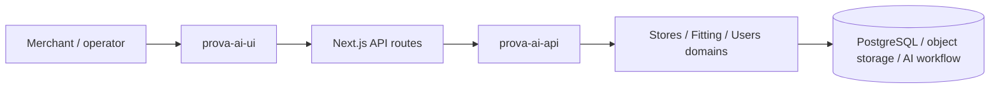
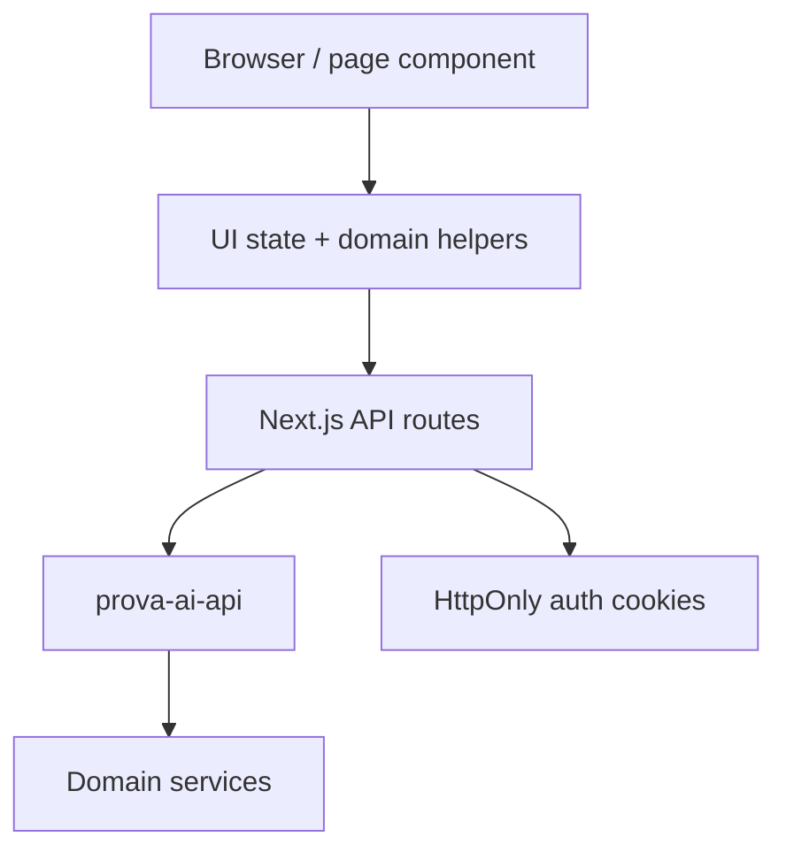

# `prova-ai-ui`

`prova-ai-ui` is the merchant-facing web application for ProvaAI.

It is the surface where store operators and internal users interact with the product as a SaaS application: log in, view dashboards, manage products, start try-on flows, and inspect results.

That makes this repository important for a different reason than the backend or Shopify widget repositories. It is the place where backend capability becomes an operational product experience.

---

## 1. Why this repository matters

From a portfolio perspective, `prova-ai-ui` shows that ProvaAI is not just:

- a backend workflow engine
- a storefront widget
- a technical proof of concept

It also includes a real application layer for authenticated users.

This repo demonstrates:

- merchant/admin experience design
- protected-route application structure
- server-mediated auth and API proxying
- workflow-oriented frontend behavior around product and fitting operations
- a reusable app shell for the product’s operational surface

In other words, this repo proves the system has an actual product cockpit, not only infrastructure and integrations.

---

## 2. Repository role in the whole product

### Summary

`prova-ai-ui` is responsible for:

- presenting the authenticated SaaS experience
- protecting application routes and user sessions
- turning backend APIs into browser-safe interactions
- supporting product and fitting workflows from the merchant side
- organizing the application into public, protected, and admin-facing route groups

---

## 3. What the repository contains

At a high level, the repository contains five major parts:

| Part | What it contains | Why it matters |
|---|---|---|
| App routes | Next.js App Router pages and route groups | Defines user-facing product flows |
| API proxy layer | `src/app/api/*` route handlers | Keeps browser/backend integration controlled |
| App shell and shared UI | layout components, brand, guards, top-level UX scaffolding | Makes the app coherent and session-aware |
| Domain helpers | catalog and fitting helpers, hub client, auth modules | Encodes frontend-side product behavior |
| State and permissions | auth/permission hooks and session-aware guards | Protects routes and features |

This repo is therefore not only a collection of screens. It is the browser-facing orchestration layer for merchant operations.

---

## 4. Internal structure and major boundaries

### Main areas visible in the repo

- `src/app/`
- `src/components/`
- `src/lib/`
- `src/store/`
- `middleware.ts`

### What each area does

#### `src/app/`
This is the main Next.js App Router surface.

From the repo docs and file structure, it is split into route groups such as:

- `(auth)`
- `(app)`
- `(admin)`
- `api/`

That split is a strong architectural signal because it reflects product access patterns, not just file organization.

#### `src/components/`
This contains reusable presentation and layout pieces.

Notable areas include:

- `layout/`
- `auth/`
- `products/`
- shared branding/UI pieces

This supports a more coherent application shell than page-by-page duplication.

#### `src/lib/`
This contains frontend-side domain and integration helpers.

From the docs, this includes areas like:

- `hub.client.ts`
- `catalog/`
- `fitting/`
- `modules/`

This is where backend interaction is turned into app-level frontend behavior.

#### `src/store/`
This contains session and permissions-related state.

The current code shows `usePermissions.ts` as an active session/identity hook, including:

- user loading
- role evaluation
- auth state inference
- permission checks
- reload/caching behavior

#### `middleware.ts`
The README and context docs identify middleware as a protected-route boundary for application pages such as dashboard, gallery, and try-on flows.

That is important because route protection is enforced at the app edge, not left purely to page-level UI checks.

---

## 5. Technology stack and execution model

### Main technologies

From `package.json`, the main stack includes:

- Next.js 14.2.5
- React 18
- TypeScript 5
- Tailwind CSS 3
- Zustand
- Framer Motion
- TanStack React Query readiness
- Sonner
- Lucide icons

### Execution model

This repository combines several frontend concerns in one application:

1. **server-rendered / App Router structure**
   - route groups, layouts, and API handlers
2. **client-side interaction flows**
   - gallery browsing, try-on screens, auth-aware pages
3. **server-mediated backend integration**
   - internal API routes proxying to `prova-ai-api`

That combination is a good fit for a SaaS admin application, especially where auth and uploads need careful handling.

---

## 6. Core architectural idea: a controlled front door to the backend

The most important architectural characteristic in `prova-ai-ui` is that it does **not** behave like a thin frontend that talks directly to backend APIs from every browser component.

Instead, it uses a controlled application boundary through internal API routes.

### Why this matters

This pattern gives the UI repo a strong responsibility split:

- page components stay closer to product behavior
- auth complexity stays closer to the app boundary
- browser code avoids owning every backend concern directly
- refresh and cookie behavior can be centralized

That is a better fit for an authenticated product than scattering raw backend calls across the client.

---

## 7. Route groups express product boundaries

The route-group structure is one of the clearest signs that the repo is organized around usage contexts.

### `(auth)`
This group holds public entry flows such as:

- login
- register
- forgot-password

These pages are the unauthenticated front door.

### `(app)`
This group holds the main authenticated SaaS experience.

From the repo structure and docs, this includes pages such as:

- dashboard
- galeria
- provar
- minha-loja
- config
- analytics
- widget

The `(app)/layout.tsx` file shows that protected pages are wrapped in:

- `Guard`
- `AppShell`

That means application identity and application chrome are both applied at the layout level.

### `(admin)`
This group holds narrower admin/testing surfaces such as status and tester views.

### Why this matters

This route-group split reflects:

- public vs authenticated behavior
- normal operator flows vs admin/test flows
- application structure as a product concern, not just a filesystem accident

---

## 8. The app shell is a real product scaffold

`AppShell.tsx` shows that the UI is not just a few isolated pages. It has a durable application scaffold.

### What the shell provides

- sidebar state and drawer behavior
- topbar and sub-topbar structure
- theme handling with dark/light persistence
- shared page spacing and layout rules
- consistent frame for protected application screens

### Why this matters

A stable app shell is important in a merchant/admin product because it supports:

- navigation consistency
- faster feature growth
- reusable UX patterns
- a more credible SaaS experience

It also indicates that the repository is trying to behave like an evolving application, not only a demo page collection.

---

## 9. Authentication and session boundary

The auth model described in the docs and visible in the route handlers is one of the most important parts of the UI architecture.

### Main characteristics

- session state is enforced through protected routes and guard behavior
- auth tokens are carried through HttpOnly cookie flows
- the UI proxies login/refresh/logout behavior through Next.js API handlers
- browser components do not need to own the full token lifecycle directly

### `hub` proxy behavior

The `src/app/api/hub/[...path]/route.ts` file shows that the app proxy is responsible for:

- forwarding requests to `API_BASE_URL`
- attaching authorization from cookies
- setting or clearing auth cookies on login/refresh/logout
- preserving a centralized auth boundary

### Upload boundary

The `src/app/api/hub-upload/[...path]/route.ts` handler exists as a specialized upload path that forwards multipart-style request bodies while still injecting auth.

### Why this matters

This split is technically important because the app has both:

- ordinary JSON-style backend requests
- file-bearing request flows

Those are similar concerns, but not identical ones. Treating them separately is a practical design choice.

---

## 10. Merchant-facing workflow shape

The repository supports the merchant side of the try-on product, not only static admin CRUD.

From the docs, the main UI flow includes:

- login
- dashboard
- product gallery
- fitting gallery/history
- try-on flow
- store/config pages

### The try-on page as a key example

`src/app/(app)/provar/page.tsx` shows a multi-step flow with concerns such as:

- photo selection and preview
- product selection
- fitting-session creation
- result retrieval
- loading/progress state
- result rendering

That matters because it shows the UI is not just viewing backend data. It actively participates in a workflow that spans:

- user input
- media transformation
- backend orchestration
- result display

---

## 11. Domain helpers and frontend-side orchestration

The UI code uses domain-oriented helpers rather than putting every backend call directly inside page code.

From imports and docs, the repo includes frontend-side domain areas such as:

- catalog helpers
- fitting helpers
- hub client integration
- auth modules

### Why this matters

This is valuable because a merchant app usually needs more than pretty screens. It needs:

- stable request shaping
- reusable response handling
- caching or revalidation choices
- domain language shared across pages

That gives the UI layer more structure than a purely component-driven frontend.

---

## 12. State, roles, and permissions

`usePermissions.ts` is a useful signal about the product’s access model.

### What it currently handles

- current-user loading
- role extraction
- `isAuthenticated`
- `isGlobalAdmin`
- permission checks through a role map
- reload and cache-clearing support

### Why this matters

This indicates the UI is built for more than one undifferentiated user type.

The docs also refer to roles such as:

- `User`
- `StoreAdmin`
- `GlobalAdmin`

That makes sense for a merchant/admin product, where operational capabilities differ by role.

---

## 13. Architectural strengths of the repository

## Strongest strengths

1. **clear product-facing role**
   - this repo owns the merchant/admin SaaS experience cleanly

2. **good route-boundary structure**
   - public, protected, and admin surfaces are separated clearly

3. **server-mediated auth and proxying**
   - the frontend does not dump every backend concern into browser code

4. **real application shell**
   - layout, navigation, theme, and guard behavior are coordinated

5. **workflow-oriented UI**
   - the app supports actual product operations, not just display pages

6. **frontend-domain helpers**
   - catalog and fitting behavior are organized beyond raw fetch calls

7. **mobile-first posture**
   - the repo docs explicitly frame responsive/mobile-first behavior as a design goal

---

## 14. Tradeoffs and complexity

This repo also shows signs of growth-stage complexity.

The architecture review notes describe risks such as:

- duplicated proxy paths
- overlapping auth layers
- duplicated cache logic
- large page components
- unused or historical files

### How I treat that material

For portfolio documentation, these review notes are best treated as **supporting evidence of engineering maturity**, not as the canonical architecture description.

Why:

- they are useful for identifying technical debt and refactor opportunities
- but they describe problems and cleanup ideas, not the core product story

### Practical takeaway

The repo tells two stories at once:

1. a credible merchant-facing product surface already exists
2. the codebase shows the normal consolidation pressure of an evolving application

That is realistic and often more credible than pretending the UI is architecturally perfect.

---

## 15. Why this repo is valuable in the portfolio

`prova-ai-ui` adds an important dimension to the portfolio because it shows product engineering, not only systems engineering.

It demonstrates:

- how merchants actually use the system
- how backend capability becomes a workflow interface
- how auth, routing, and app layout are shaped for a SaaS surface
- how the try-on product exists as an operational tool, not only as an API or widget demo

In short: the backend proves the system can run, the widget proves it can reach Shopify storefronts, and the UI proves it can operate as a product for authenticated users.

---

## 16. Related docs

- [`../overview/repository-map.md`](../overview/repository-map.md)
- [`../architecture/request-and-data-flows.md`](../architecture/request-and-data-flows.md)
- [`../architecture/system-architecture.md`](../architecture/system-architecture.md)
- [`./prova-ai-api.md`](./prova-ai-api.md)
- [`./prova-ai-widget.md`](./prova-ai-widget.md)
