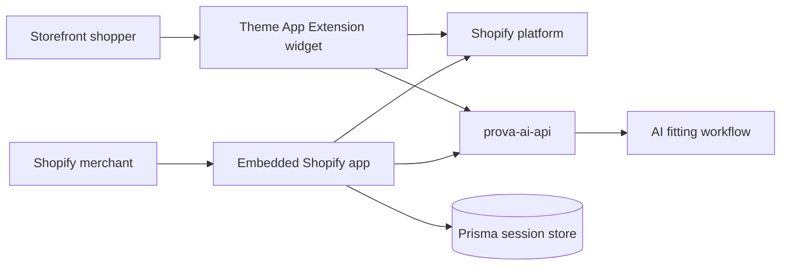
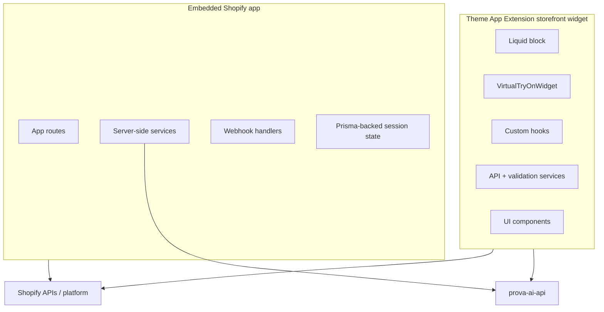
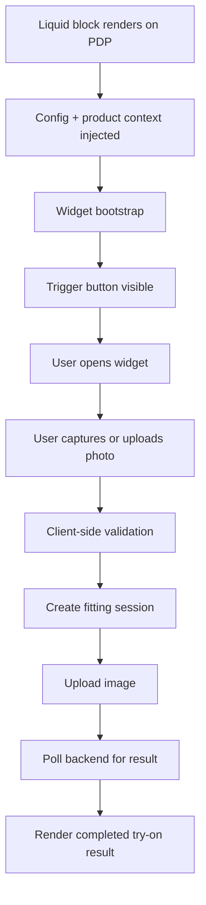

# `prova-ai-widget`

`prova-ai-widget` is the Shopify-facing edge of ProvaAI.

It is the repository that turns the backend platform into a real commerce integration by covering two distinct but connected surfaces:

1. the **embedded Shopify app** used for merchant-side integration work
2. the **storefront virtual try-on widget** that appears on product pages

That combination makes this repo more than a frontend project. It is a platform-bridge repository that sits between Shopify, merchants, shoppers, and the ProvaAI backend.

---

## 1. Why this repository matters

From a portfolio perspective, `prova-ai-widget` tells a strong story because it combines several kinds of complexity at once:

- external platform integration through Shopify
- embedded-app concerns such as auth, sessions, and webhooks
- shopper-facing storefront UI constraints
- asynchronous try-on workflow coordination
- a layered widget architecture instead of a single-script implementation
- operational concerns such as app config, deploy flow, and extension packaging

Many teams can build a dashboard. Fewer can build a storefront extension that has to live safely inside a third-party commerce page while still coordinating with a custom backend workflow.

---

## 2. Repository role in the whole product

### Summary

`prova-ai-widget` is responsible for:

- hosting the Shopify app boundary
- authenticating and persisting Shopify-side app sessions
- registering app configuration and webhooks
- injecting the storefront widget into product pages
- collecting shopper input and sending try-on requests to the backend
- rendering the result without breaking the host Shopify PDP

---

## 3. What the repository contains

At a high level, the repository contains four major parts:

| Part | What it contains | Why it matters |
|---|---|---|
| Embedded app | React Router app, Shopify app setup, routes, services | Merchant-side Shopify integration surface |
| Theme App Extension | Liquid block, built assets, widget source | Storefront entry point for shoppers |
| Widget runtime | React components, hooks, services, utilities | Safe, layered shopper-facing try-on flow |
| Persistence/config | Prisma schema, Shopify app config, metafields/webhooks | Operational integration state |

The repo is therefore both:

- an integration application
- a deployable storefront feature package

---

## 4. Internal structure and major boundaries

### Main top-level areas

- `app/`
- `extensions/`
- `docs/`
- `prisma/`
- `shopify.app.toml`

### What each area does

#### `app/`
The embedded Shopify app lives here.

It includes:

- app routes such as `app.virtual-try-on.*`, `app.products`, `app.settings`, `app.billing`
- Shopify auth and consent routes
- webhook handlers
- server-side services for product, shop, metafield, and session-token behavior
- tests around app-side session bootstrap and service behavior

This is the merchant/operator-facing integration control surface.

#### `extensions/`
The storefront widget lives here.

It includes:

- source files under `extensions/src/prova-ai-widget-extension/`
- built extension assets and blocks
- the Liquid block that injects widget config into Shopify product pages

This is the shopper-facing runtime surface.

#### `prisma/`
This defines persistent data for Shopify-side app state.

From `schema.prisma`, the repo tracks models such as:

- `Session`
- `Consent`
- `VirtualTryOnSession`

That shows the repo is not only rendering UI. It also owns Shopify-app session and integration state.

#### `docs/`
The docs are unusually helpful for this repo.

They describe:

- the layered widget architecture
- visual UI flow maps
- API integration patterns
- metafield behavior
- deployment handoff details

That documentation depth makes the repo much easier to explain in a portfolio context.

---

## 5. Technology stack and platform model

### Main technologies

- React 18
- TypeScript
- React Router 7
- Vite
- Shopify App Bridge React
- Shopify Polaris
- Prisma
- Vitest
- Tailwind CSS v4
- Framer Motion

### Platform model

The repo combines three different execution contexts:

1. **embedded app runtime**
   - merchant/admin-facing app inside Shopify
2. **storefront extension runtime**
   - widget injected into the product page
3. **backend integration runtime**
   - calls from the app/widget into `prova-ai-api`

This is important because those contexts have different constraints:

- the embedded app deals with Shopify auth/session patterns
- the storefront widget must be light, resilient, and safe on the PDP
- the backend call path has to coordinate asynchronous AI/media processing

---

## 6. Core architectural idea: one repo, two surfaces

The most important thing to understand about `prova-ai-widget` is that it owns **both** the merchant integration surface and the shopper interaction surface.

### Why this matters

This is not just a website plus a script tag.

It is a coordinated integration layer that has to:

- live inside Shopify’s app model
- configure storefront behavior
- carry product/store context into the widget
- bridge shopper actions into backend fitting sessions

That makes the repo architecturally distinctive.

---

## 7. The storefront widget as the technical centerpiece

The storefront widget is the most distinctive part of the repository.

From the architecture docs, it follows a layered structure:

1. **presentation components**
2. **custom hooks for state management**
3. **services for business logic and API behavior**
4. **shared utilities**

### Key components mentioned in the docs

- `VirtualTryOnWidget.tsx`
- `VirtualTryOnFlow.tsx`
- `TriggerButton.tsx`
- `CameraCapture.tsx`
- `PreviewArea.tsx`
- `Modal.tsx`
- `PhotoUploadStep.tsx`
- `PhotoConfirmStep.tsx`
- `TryOnGallery.tsx`
- `TryOnHistory.tsx`

### Why this matters

This is a stronger design than a typical “all logic in one widget file” implementation.

It improves:

- readability
- testability
- separation of UI and behavior
- resilience when the flow grows more complex

---

## 8. Defensive rendering is a first-class design decision

The widget docs repeatedly emphasize defensive rendering.

That is one of the best technical signals in this repo.

### What defensive rendering means here

- widget initialization is guarded
- failure should not break the product page
- configuration errors degrade gracefully
- the extension tries to isolate its own faults
- heavy behavior is delayed until the user interacts

### Why this matters on Shopify

A storefront widget runs in a fragile environment:

- the product page belongs to the merchant storefront
- the page already has its own theme code and scripts
- third-party widget failure must not take down the PDP

That makes defensive rendering more than a nice-to-have. It is an architectural requirement.

---

## 9. Widget lifecycle and shopper flow

The shopper flow is not a single request. It is a staged asynchronous workflow.

### Important details from the docs

- widget initialization reads data attributes from the Liquid block
- startup uses guarded/singleton behavior
- the flow has explicit UI states such as upload, confirm, processing, and gallery
- polling is used for terminal-state retrieval
- result rendering is state-driven rather than synchronous

### Why this is valuable in the portfolio

This shows a real workflow architecture:

- context setup
- media input
- validation
- asynchronous processing
- result delivery
- retry/error paths

That is much stronger than a static storefront enhancement.

---

## 10. Merchant-side Shopify app responsibilities

The embedded app side of the repo handles the merchant/platform integration work needed to make the storefront feature real.

### What the app side appears to handle

From the route and service layout, it includes:

- Shopify auth and consent handling
- session bootstrap behavior
- product/shop/metafield services
- virtual-try-on app routes
- webhook handling for app lifecycle events
- Shopify-side diagnostics and testing routes

### Why this matters

A storefront widget alone is not enough for a robust Shopify integration.

The system also needs:

- app install/auth flows
- merchant-level configuration
- app-side persistence and shop context
- webhook-driven lifecycle handling

This is why `prova-ai-widget` should be understood as an integration app plus extension package, not just as a frontend widget repo.

---

## 11. Configuration, scopes, and platform permissions

`shopify.app.toml` shows that this repo explicitly owns Shopify app configuration.

### Important signals from the config

- the app is `embedded = true`
- webhook subscriptions are declared for uninstall and scopes updates
- app-level access scopes are explicitly listed
- a product metafield definition exists for virtual try-on config
- redirect URL handling is part of the app contract

### Why this matters

This is portfolio-worthy because it shows the integration is real platform work, including:

- scopes
- webhooks
- embedded runtime setup
- metafield-based product configuration

These are the operational seams that often make Shopify work harder than ordinary web-app development.

---

## 12. Persistence and session state

The Prisma schema shows that this repo owns persistent Shopify-side state.

### Notable models

#### `Session`
Tracks Shopify app session/auth details.

#### `Consent`
Tracks merchant consent state.

#### `VirtualTryOnSession`
Tracks try-on session metadata with fields such as:

- `shopId`
- `productId`
- `sessionId`
- `status`
- `expiresAt`

### Why this matters

This persistence layer shows the repo is not only a presentation layer. It has to manage:

- app identity and lifecycle
- merchant consent state
- correlation between storefront actions and try-on sessions

That makes it an integration system, not just a UI bundle.

---

## 13. Build, deploy, and test shape

From `package.json`, the repo supports workflows for:

- widget build via Vite
- app development via Shopify CLI
- app deploy via Shopify CLI
- Prisma setup/migrate
- typecheck
- lint
- Vitest-based testing
- coverage reporting

### Example workflow responsibilities encoded in scripts

- `build:widget`
- `dev`
- `deploy`
- `setup`
- `typecheck`
- `test`
- `test:coverage`

### Why this is a good sign

This indicates the repo is treated like a real product surface with:

- build discipline
- typed boundaries
- test support
- CLI-driven operational workflows

---

## 14. Architectural strengths of the repository

## Strongest strengths

1. **clear platform boundary ownership**
   - Shopify-specific concerns are isolated from the main backend repo

2. **two-surface integration model**
   - embedded app plus storefront widget in one coherent integration package

3. **layered widget architecture**
   - components, hooks, services, utilities

4. **defensive storefront design**
   - protects the PDP from widget faults

5. **explicit platform configuration**
   - app config, scopes, metafields, webhooks are visible and versioned

6. **real async workflow coordination**
   - the widget does not fake try-on; it coordinates a backend session lifecycle

7. **good documentation density**
   - architecture, visual flow, API integration, and metafield notes all support maintainability

---

## 15. Tradeoffs and complexity

This repository also carries real complexity.

### Main tradeoffs

1. **mixed runtime contexts**
   - embedded app, storefront widget, and backend integration each behave differently

2. **platform dependence**
   - Shopify’s auth, scope, and extension model shape the architecture heavily

3. **storefront fragility**
   - even small bugs can degrade product-page experience if not carefully isolated

4. **async UX complexity**
   - users must move through staged upload/processing/result flows cleanly

5. **cross-repo coordination**
   - the widget depends on backend contracts remaining stable

These tradeoffs are exactly why this repo is worth documenting well. They reflect real product engineering constraints rather than toy-demo complexity.

---

## 16. Why this repo is valuable in the portfolio

`prova-ai-widget` is valuable because it shows engineering ability in a space many portfolios do not cover well:

- commerce-platform integration
- embedded app architecture
- storefront-safe widget design
- async AI workflow coordination at the edge
- practical frontend architecture under third-party constraints

In short: this repo shows that ProvaAI is not only a backend system and not only a polished UI. It also has a real integration layer that translates product capability into a merchant-installable storefront experience.

---

## 17. Related docs

- [`../overview/repository-map.md`](../overview/repository-map.md)
- [`../architecture/system-architecture.md`](../architecture/system-architecture.md)
- [`../architecture/request-and-data-flows.md`](../architecture/request-and-data-flows.md)
- [`./prova-ai-api.md`](./prova-ai-api.md)
